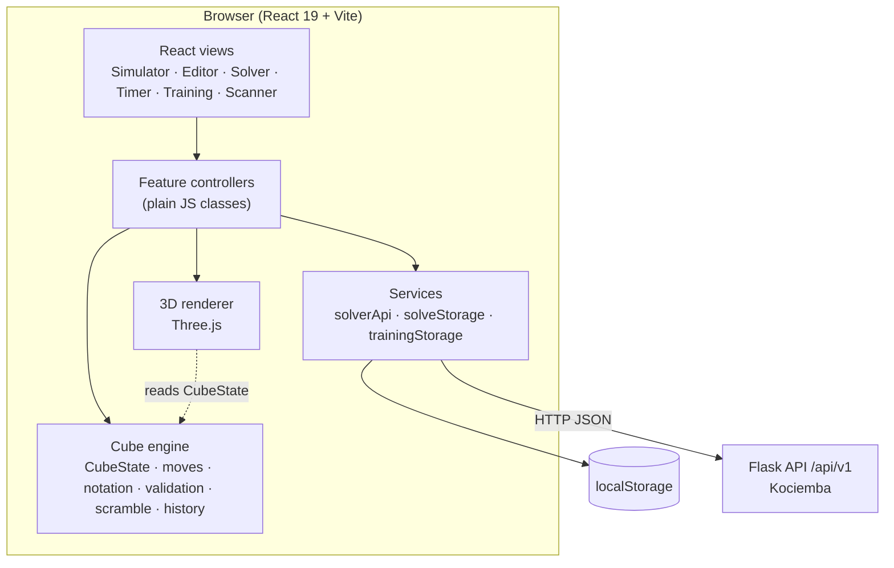
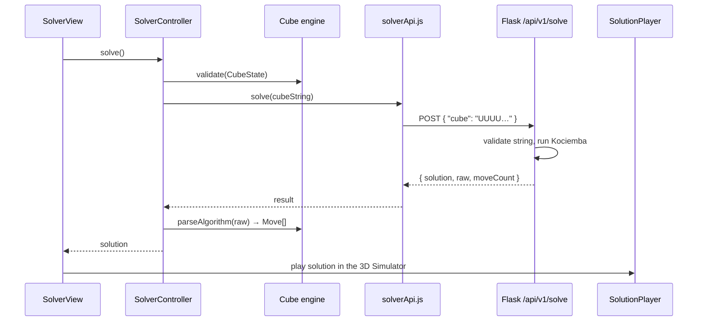

<div align="center">

# CubeStudio V2

**A web-based Rubik's Cube simulator, editor, solver, speedcubing timer, trainer, and camera scanner, built on a framework-independent cube engine.**

[](https://react.dev)
[](https://vitejs.dev)
[](https://threejs.org)
[](https://flask.palletsprojects.com)
[](https://www.python.org)
[](https://vitest.dev)

[Features](#features) · [Architecture](#architecture) · [Getting Started](#getting-started) · [API](#api) · [Testing](#testing) · [Roadmap](#roadmap)

</div>

---

## Overview

CubeStudio V2 is a single-page React application for working with the 3×3 Rubik's Cube. You can turn a 3D cube, paint a state by hand, scan a physical cube with your webcam, solve it with Kociemba's two-phase algorithm, replay the solution move by move, time your own solves with WCA-style inspection, and practice with guided lessons and drills.

It is a ground-up rewrite. Every feature shares one authoritative cube model (`CubeState`), and the cube logic lives in a pure JavaScript engine with no dependency on React, Three.js, the DOM, or the backend. The 3D renderer, the 2D editor, the scanner, the solver, the timer, and the trainers all sit on top of that engine instead of keeping their own copies of the cube.

> **Status:** Phases 0 to 8 of the project plan are implemented (see [Development Status](#development-status)). The camera scanner is covered by automated tests but has not yet been verified against a physical webcam and cube.

---

## Features

| Area | What it does |
| --- | --- |
| **3D Simulator** | Interactive Three.js cube with orbit/zoom controls, animated face turns, a FIFO move queue, undo/redo, random 20-move scrambles, adjustable animation speed, and keyboard shortcuts |
| **Cube Editor** | Unfolded 2D net with a colour palette, per-face colour counts, fixed centres, live validation, undo/redo, and import/export of 54-character cube strings |
| **Validation** | Multi-tier checks: format, symbols, colour counts, centres, impossible or duplicate pieces, corner twist parity, edge flip parity, and permutation parity |
| **Solver** | Sends a validated cube to a Flask + Kociemba backend and shows the solution as move chips, with live backend health status |
| **Solution Player** | Step forward/back, restart, autoplay at 0.5x to 2x, progress bar, and natural-language hints, all driving the 3D simulator |
| **Speedcubing Timer** | Spacebar-driven timer with optional 15 s inspection, automatic +2 / DNF penalties, and WCA-style scrambles |
| **Solve History & Stats** | Best single, session mean, Ao5, Ao12, Ao50, Ao100, and improvement; solve list with details, delete/clear, and JSON/CSV export |
| **Training** | 9-lesson beginner curriculum, move and notation trainer, CFOP algorithm trainer, mistake detection, and a progress dashboard |
| **Camera Scanner** | In-browser six-face scan using canvas-based detection and HSL colour classification, with per-face review, full-net review, and hand-off to the Simulator, Solver, or Editor |

<details>
<summary><strong>Feature details</strong></summary>

**Simulator**
- Mouse/touch orbit and wheel zoom via pointer events
- Face buttons plus prime (`'`) and double (`2`) modifiers
- Keyboard: `U D L R F B` turn a face, `Shift` + face for prime, `Alt` + face for double, `Space` scrambles, `Esc` resets, `Ctrl/Cmd+Z` undoes, `Ctrl/Cmd+Y` (or `Shift+Ctrl/Cmd+Z`) redoes
- Speed presets: Instant, Fast (100 ms), Normal (200 ms), Smooth (350 ms)
- One-click hand-off of the current state to the Editor or Solver

**Timer**
- State machine: `IDLE → INSPECTION → READY → RUNNING → STOPPED → SAVED`
- Elapsed time comes from `performance.now()` (injectable clock for tests), not from tick counts
- Raw time is never modified; `+2` and `DNF` are stored as a separate penalty field
- Inspection over 15 s gives +2, over 17 s gives DNF
- Solves persist in `localStorage`; corrupted data is filtered and recovered

**Training**
- Curriculum: Cube Basics, Cube Notation, White Cross, White Corners, Second Layer, Yellow Cross, Yellow Face, Last-Layer Corners, Last-Layer Edges
- Lesson phases: `NOT_STARTED → INTRO → EXPLANATION → DEMO → PRACTICE → COMPLETED`, with tiered hints
- Lesson completion is checked against the real `CubeState`, not by button clicks
- Move Trainer modes: move practice, notation reading, sequence drill, with move-group filters
- Algorithm Trainer: a catalogue of 25 algorithms (3 cross, 6 F2L, 10 OLL, 6 PLL) with automatic case setup
- Mistake types: `CORRECT`, `WRONG_DIRECTION`, `WRONG_FACE`, `INCOMPLETE_DOUBLE`, `DIVERGENCE`, `SKIPPED`
- Stats (attempts, accuracy, streaks, mistake distribution) persist in `localStorage`

**Scanner**
- Camera lifecycle managed by `CameraController` (front/back camera toggle, explicit track release)
- Frame analysis runs on an offscreen canvas via `requestAnimationFrame`, so React does not re-render per frame
- Capture requires a stable quality state (`SEARCHING`, `DETECTED`, `ALIGNING`, `READY`, `CAPTURED`, `LOW_LIGHT`, `POOR_ALIGNMENT`, `LOW_CONFIDENCE`)
- Faces are identified by their centre colour; the session tracks `U → R → F → D → L → B`
- The reconstructed state goes through the same `validate()` used everywhere else, and failures suggest which faces to rescan
- No machine-learning dependency and no images sent to a server

</details>

---

## Architecture

The core idea is one-way layering. The cube engine knows nothing about the UI. Renderers, editors, and trainers read and write `CubeState`; controllers keep logic out of React components; and the only network access is behind a single service module.



### Layers

| Layer | Location | Responsibility |
| --- | --- | --- |
| **Cube engine** | `src/cube/model`, `src/cube/engine` | Pure JavaScript. State, moves, notation, permutations, validation, scrambles, history. No React, Three.js, DOM, or backend imports |
| **3D renderer** | `src/cube/rendering` | Three.js presentation of a `CubeState`: 26 cubie meshes, pivot-group move animation, FIFO animation queue |
| **Feature controllers** | `src/features/*/*Controller.js` | UI-independent state machines and logic (simulator, editor, solver, solution player, timer, trainers, scanner session) |
| **Views** | `src/features/*/*View.jsx` | React presentation for each tab |
| **Services** | `src/services` | HTTP access to the backend and `localStorage` persistence |
| **Backend** | `backend/app.py` | Flask API for validation and Kociemba solving |
| **App shell** | `src/app/App.jsx` | Tab navigation and hand-off of a shared `CubeState` between tabs (no router or state library) |

### Design decisions

Decisions are recorded in [`docs/ARCHITECTURE-DECISIONS.md`](docs/ARCHITECTURE-DECISIONS.md). The ones that shape the code most:

- **`CubeState` is the single source of truth.** It is a 54-facelet array. Corner and edge data (position, orientation) are derived from it on demand for validation and never stored as a second representation.
- **The engine is framework-independent.** It runs identically in the browser and in Node, which is why the engine tests need no DOM or WebGL.
- **The renderer never owns cube state.** After every move, undo, reset, or cancellation the renderer is hard-synced to `CubeState`, so floating-point drift in mesh transforms cannot accumulate.
- **The Solution Player has no animation logic of its own.** It is a headless state machine that dispatches moves (and their inverses for stepping back) into the `SimulatorController`, so playback and manual play share one path.
- **Simulator moves are tagged by source** (`user`, `setup`, `scramble`, `algorithm`). Trainers only score `user` moves, so automatic case setup never counts as a learner attempt.
- **All backend calls go through `solverApi.js`.** Components and controllers never call `fetch` directly, which makes them testable with a mocked service.
- **Timer accuracy is independent of rendering.** Time is computed as `now() - start` from a monotonic clock, not from intervals.

---

## Cube Engine

Located in `src/cube/`, exported through `src/cube/index.js`.

- **`CubeState`**: 54 facelets in Kociemba/Singmaster order `U R F D L B`, nine per face, indexed top-left to bottom-right (index 4 is the fixed centre). Supports `createSolved()`, `clone()`, `getSticker/setSticker`, `getFace/setFace`, `isSolved()`, `equals()`, and `serialize`/`deserialize` as a 54-character string, a 54-element array, or a per-face JSON object.
- **Colours**: Western scheme, `U` white, `R` red, `F` green, `D` yellow, `L` orange, `B` blue.
- **Moves**: 18 face turns (`U D L R F B`, each as clockwise, prime, and double) represented by a `Move` class with inverse and composition. Slice moves, wide moves, and whole-cube rotations (`M`, `x`, `Rw`, and so on) are not supported by the parser.
- **Notation**: WCA/Singmaster parser with prime variants (`'`, `’`, `i`), comment stripping (`//`, `#`), and group multipliers such as `(R U R' U')*3`; `formatAlgorithm` and `inverseAlgorithm` included.
- **Applying moves**: `applyMove`, `applyMoves`, and `applyAlgorithm` are pure and non-mutating, built on precomputed 54-facelet permutations.
- **Validation**: `validate()` returns `{ valid, error? }` with a code from `VALIDATION_ERRORS` (`MALFORMED_DATA`, `INVALID_SYMBOLS`, `INVALID_COUNTS`, `INVALID_CENTERS`, `IMPOSSIBLE_PIECE`, `DUPLICATE_PIECES`, `CORNER_TWIST_PARITY`, `EDGE_FLIP_PARITY`, `PERMUTATION_PARITY`).
- **Scrambles**: `generateScramble` / `generateScrambleString` avoid same-face and same-axis repeats and accept a seed (Mulberry32 PRNG) for reproducible output.
- **History**: `CubeHistory` provides undo, redo, move count, and branching (a new move discards the undone future).

```js
import { CubeState, applyAlgorithm, validate, generateScrambleString } from './src/cube/index.js';

const scrambled = applyAlgorithm(CubeState.createSolved(), generateScrambleString(20, 42));

validate(scrambled);          // { valid: true }
scrambled.serialize('string') // 54-character Kociemba string
```

---

## Solver

Solving uses the two-phase Kociemba algorithm from the Python `kociemba` package. It runs in the Flask backend, and the browser talks to it through one service module.



1. `SolverView` shows the current `CubeState` (received from the Simulator, Editor, Timer scramble, or Scanner) and runs local validation, so most invalid cubes are rejected without a network call.
2. `SolverController` serializes the state to a 54-character string and calls `solverApi.solve()`.
3. The backend re-validates the string (length, symbols, nine of each face, fixed centres) and calls `kociemba.solve()`. It returns the moves as a list, the raw string, and the move count.
4. The controller parses the raw string into `Move` instances. The **Solution Player** steps through them, forwarding each move to the 3D simulator (or its inverse when stepping back).

The Solver tab also displays the backend health status (via `GET /api/v1/health`) with a retry button.

---

## Tech Stack

**Frontend**
- React 19, Vite 5
- Three.js (3D rendering)
- lucide-react (icons)
- Plain JavaScript (ES modules), CSS with design tokens; no router or state-management library

**Backend**
- Python 3.9+, Flask 3, Flask-CORS
- `kociemba` (two-phase solver)
- `gunicorn` (listed for production serving)

**Testing**
- Vitest (frontend and engine)
- pytest with the Flask test client (backend)

**Tooling**
- npm (`package-lock.json`)

---

## Project Structure

```text
CubeStudio-V2/
├── src/
│   ├── cube/
│   │   ├── model/          # CubeState, moves, notation, cubies, constants, stickers
│   │   ├── engine/         # applyMove, permutations, validation, scramble, history
│   │   ├── rendering/      # Three.js scene, renderer, mesh factory, animator, queue
│   │   └── index.js        # public engine API
│   ├── features/
│   │   ├── simulator/      # 3D simulator controller + view
│   │   ├── editor/         # 2D net editor
│   │   ├── solver/         # solver + solution player
│   │   ├── timer/          # timer, statistics, solve history
│   │   ├── training/       # curriculum, trainers, CFOP data, mistake detection
│   │   └── scanner/        # camera pipeline, session, reconstruction
│   ├── services/           # solverApi, solveStorage, trainingStorage
│   ├── app/                # App shell and navigation
│   ├── styles/             # design tokens
│   └── main.jsx
├── backend/
│   ├── app.py              # Flask API
│   ├── requirements.txt
│   ├── .env.example
│   └── tests/test_api.py
├── tests/                  # Vitest suites: cube/, features/, rendering/, services/
├── docs/                   # status, architecture decisions, build log, test status
├── .env.example            # frontend environment template
├── index.html
├── vite.config.js
└── package.json
```

The numbered Markdown files in the repository root (`00-project-spec.md` to `10-deployment.md`) are the original specifications. For what is actually built, use [`docs/IMPLEMENTATION-STATUS.md`](docs/IMPLEMENTATION-STATUS.md).

---

## Getting Started

### Prerequisites

- **Node.js** 18 or newer (required by Vite 5) and npm
- **Python** 3.9 or newer and pip (only needed for the solver backend)
- A C compiler may be needed if `kociemba` has to build from source on your platform

### 1. Clone and install the frontend

```bash
git clone https://github.com/prajwalmeshram06/CubeStudio-V2.git
cd CubeStudio-V2
npm install
```

### 2. Configure the frontend

```bash
cp .env.example .env
```

### 3. Start the backend

```bash
cd backend
python3 -m venv .venv
source .venv/bin/activate        # Windows: .venv\Scripts\activate
pip install -r requirements.txt
python3 app.py                   # listens on port 5000 by default
```

### 4. Start the frontend

In a second terminal, from the repository root:

```bash
npm run dev
```

Open the URL Vite prints (`http://localhost:5173` by default).

> The Simulator, Editor, Timer, Training, and Scanner tabs work without the backend. Only the **Solver** tab needs it.

### Production build

```bash
npm run build      # outputs to dist/
npm run preview    # serve the built app locally
```

---

## Environment Variables

**Frontend**: `.env.example` in the repository root

| Variable | Default | Description |
| --- | --- | --- |
| `VITE_API_BASE_URL` | `http://localhost:5000` | Backend base URL, without a trailing slash |

**Backend**: `backend/.env.example`

| Variable | Default | Description |
| --- | --- | --- |
| `PORT` | `5000` | Port used by `python3 app.py` |
| `FLASK_DEBUG` | `false` | Enables Flask debug mode when `true` |
| `CORS_ORIGINS` | `*` if unset (`.env.example` uses `http://localhost:5173`) | Comma-separated list of allowed origins for `/api/*` |

The backend reads its configuration from the process environment and does not load `.env` files itself, so export the variables in your shell (or set them inline) to change them:

```bash
PORT=5001 CORS_ORIGINS=http://localhost:5173 python3 app.py
```

If you change the port, set `VITE_API_BASE_URL` to match.

---

## API

Base path: `/api/v1`. All request and response bodies are JSON.

| Method | Endpoint | Purpose |
| --- | --- | --- |
| `GET` | `/api/v1/health` | Service status |
| `POST` | `/api/v1/validate` | Validate a cube string and check that it is solvable |
| `POST` | `/api/v1/solve` | Return a Kociemba solution |

**Solve**

```http
POST /api/v1/solve
Content-Type: application/json

{ "cube": "DLUBUBDFURBRFBLRLDDRFDFULUBLUBBDRRULBBLFRFUFDRFULDFLRD" }
```

Response shape (the move list is abbreviated here):

```json
{
  "solution": ["R", "U'", "F2", "..."],
  "raw": "R U' F2 ...",
  "moveCount": 20
}
```

`solution` is the raw solver string split on whitespace into move tokens, so it looks like `["R", "U'", "F2", …]`. An already-solved cube returns an empty `solution` and `moveCount: 0`.

`cube` is a 54-character string over `U R F D L B` in face order U, R, F, D, L, B.

**Errors** use a consistent envelope and never include stack traces:

```json
{ "error": { "code": "INVALID_CUBE", "message": "…" } }
```

| Code | HTTP | Meaning |
| --- | --- | --- |
| `INVALID_REQUEST` | 400 / 413 | Not JSON, missing `cube`, wrong type or length, payload too large |
| `INVALID_CUBE` | 422 | Bad symbols, wrong colour counts, or wrong centres |
| `UNSOLVABLE_CUBE` | 422 | Kociemba rejected the state |
| `SOLVER_ERROR` | 500 | Unexpected solver failure |
| `NOT_FOUND` / `METHOD_NOT_ALLOWED` | 404 / 405 | Unknown endpoint or wrong method |
| `INTERNAL_ERROR` | 500 | Unhandled exception |

`/api/v1/validate` runs the same string checks and then a Kociemba solve to confirm the cube is physically solvable.

---

## Testing

```bash
# Frontend and cube engine (Vitest)
npm test

# Watch mode
npm run test:watch
```

```bash
# Backend (pytest); from the repository root, with backend dependencies installed
pip install pytest
python3 -m pytest backend/tests -v
```

The suites cover the cube engine (including property-style checks such as `M · M⁻¹ = I` and round-trips over random scrambles), the renderer's mesh/state syncing, controllers, the solution player, timer and statistics, storage, the training system, the scanner pipeline, and the Flask API.

At the time of writing the repository contains **40 Vitest files (311 test cases)** and **22 pytest cases**. Per-suite detail is in [`docs/TEST-STATUS.md`](docs/TEST-STATUS.md).

Vitest runs in the `node` environment, so no browser or WebGL context is needed. Scanner tests cover the processing pipeline and reconstruction logic; they do not exercise a real camera feed.

---

## Development Status

CubeStudio V2 is under active development. The phases below are complete according to [`docs/IMPLEMENTATION-STATUS.md`](docs/IMPLEMENTATION-STATUS.md).

| Phase | Scope | State |
| --- | --- | --- |
| 0 | Project foundation and pure cube engine | Done |
| 1 | Three.js renderer and simulator | Done |
| 2 | Manual editor and validation | Done |
| 3 | Flask backend and Kociemba solver | Done |
| 4 | Solution player and hints | Done |
| 5 | Timer, solve history, statistics | Done |
| 6A / 6B | Beginner curriculum; move, notation, and CFOP trainers | Done |
| 7A / 7B | Camera scanner and full-cube reconstruction | Done (automated tests only; physical camera verification pending) |
| 8 | Documentation reconciliation | Done |

There is no live deployment and no CI configuration in the repository at present.

### Roadmap

Planned, **not implemented**:

- Algorithm library with search and filtering
- Cube analysis
- Solution optimization
- PWA and mobile support
- Authentication and cloud sync
- AI cube coach
- Sharing / social features
- Additional puzzle types

Scope for several of these is still to be defined.

---

## Deployment

No deployment configuration (Docker, hosting manifests, CI) is committed. For a manual deployment:

- **Frontend**: run `npm run build` and serve `dist/` from any static host, with `VITE_API_BASE_URL` set at build time to your backend URL.
- **Backend**: `gunicorn` is included in `backend/requirements.txt`, for example `gunicorn app:app --bind 0.0.0.0:5000` from the `backend/` directory. Set `CORS_ORIGINS` to your frontend origin and leave `FLASK_DEBUG` off.

[`10-deployment.md`](10-deployment.md) describes the intended deployment approach.

---

## Contributing

Issues and pull requests are welcome. Before opening a PR:

1. Keep cube logic in `src/cube/model` and `src/cube/engine` free of React, Three.js, DOM, and network code.
2. Route backend calls through `src/services/solverApi.js`.
3. Add or update tests, and make sure `npm test` (and `pytest` for backend changes) pass.

---

## License

No license has been specified for this repository yet.

---

## Documentation

| Document | Contents |
| --- | --- |
| [`docs/IMPLEMENTATION-STATUS.md`](docs/IMPLEMENTATION-STATUS.md) | Phase checklist and per-feature status |
| [`docs/ARCHITECTURE-DECISIONS.md`](docs/ARCHITECTURE-DECISIONS.md) | Architecture decision records (ADR-0001 to ADR-0013) |
| [`docs/TEST-STATUS.md`](docs/TEST-STATUS.md) | Test suites and coverage notes |
| [`docs/BUILD-LOG.md`](docs/BUILD-LOG.md) | Phase-by-phase development log |
| [`docs/LEGACY-FEATURE-MAP.md`](docs/LEGACY-FEATURE-MAP.md) | Mapping from the original CubeStudio to V2 |
| [`DESIGN.md`](DESIGN.md) | UI/UX design brief |